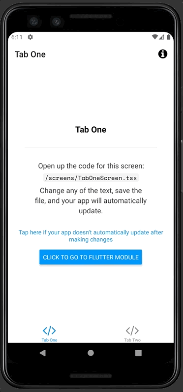

# App made with Flutter and React Native

This project is a mixture of Flutter and React Native.

- The app was generated with Expo CLI.
- Then we ejected
- Then added Flutter
- Then made a simple communication system between the two apps.

> **Note:** Currently works only on Android, I'm gonna make it work on iOS ASAP. I think I might do a medium article describing how to make this.

